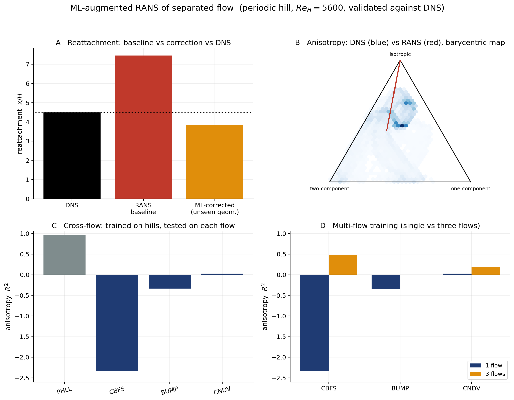

# ML-Augmented RANS Modelling of Separated Flow Using DNS Reference Data


A CFD + machine-learning study of whether a lightweight, **interpretable**
data-driven correction can reduce the systematic model-form error of RANS
(k-ω SST) for separated turbulent flow over periodic hills — validated against
DNS across five geometries and, ultimately, against **completely different
separated flows**.

<p align="center">
  
  <br>
  <em>The model-form error, made visible: baseline k-ω SST (top) predicts a
  recirculation bubble far longer than DNS (bottom). The black line encloses the
  reversed-flow region.</em>
</p>

> **Two-page summary for a quick read: [REPORT.md](REPORT.md).**
> **Full results write-up with figures: [RESULTS.md](RESULTS.md).**

```
 baseline RANS (k-ω SST, OpenFOAM)
   -> co-located DNS reference
      -> interpretable correction target (eddy viscosity / stress anisotropy)
         -> geometry-agnostic features
            -> interpretable models (ridge / RF / gradient boosting / TBNN)
               -> a-posteriori injection via custom OpenFOAM solvers
                  -> honest generalisation tests (geometry, then flow type)
```

> This is **not** a claim that ML "solves turbulence" or replaces turbulence
> models. It quantifies where a standard closure fails against DNS on a canonical
> separated flow, tests how far a simple, physically grounded correction can
> close that gap, and maps — honestly — where and why it does not.

**Status:** complete end-to-end and then some — baseline failure map (MVR-1),
feature/target dataset (MVR-2), interpretable correction + geometry-wise
validation (MVR-3), a-posteriori correction (MVR-4) with **two custom-compiled
OpenFOAM solvers**, a Reynolds-stress **anisotropy** target and a **tensor-basis
neural network** (MVR-6), **nonlocal** features (MVR-7), and **cross-flow**
(MVR-8) → **multi-flow** (MVR-9) generalisation, plus mesh-independence,
statistical-rigor and robustness checks. Headline numbers in
[Results](#results) / [RESULTS.md](RESULTS.md); breakdown in the
[roadmap](#roadmap).

---

## Why this project

I am an MSc Computational Fluid Dynamics student. This project demonstrates
**data-driven turbulence-closure modelling** on the problem where RANS models are
most wrong — smooth-body separation — with a deliberately honest treatment of
generalisation.

It shares a *workflow philosophy* with my other projects — build a physics
database, then a validated data-driven surrogate/correction — but is deliberately
different in physics and ML focus:

- **[OpenFOAM dam-break surrogate](https://github.com/ThomasBainbridge/openfoam-dambreak-surrogate)** — automated VOF database + impact-metric surrogates + POD free-surface reconstruction (two-phase free surface).
- **[Reduced-order particle-laden flow](https://github.com/ThomasBainbridge/Reduced-Order-Particle-Flow)** — latent-space forecasting of an evolving concentration field (Lagrangian inertial particles).

Here the physics is **turbulence model-form error** and the ML focus is an
**interpretable, physically-constrained correction** with rigorous
out-of-distribution validation.

---

## Problem

A periodic-hill flow separates off the smooth crest, recirculates in the lee, and
reattaches downstream. Linear-eddy-viscosity RANS closures systematically
mispredict this — the separation point, the recirculation bubble, and especially
the reattachment location. The goal is to learn a correction to that error from
DNS data and test how well it generalises.

**Benchmark:** periodic hill, `Re_H = U_b H / ν = 5600`.
**Baseline solver:** OpenFOAM `simpleFoam`, k-ω SST, steady, quasi-2D.
**Reference:** parameterised-geometry DNS (Xiao et al. 2020), five hill slopes.

## Governing equations

Steady incompressible RANS — the mean momentum balance carries the Reynolds
stress `τ_ij = <u'_i u'_j>`, which the turbulence model must supply:

$$\nabla\cdot(\mathbf{U}\otimes\mathbf{U}) = -\nabla p + \nabla\cdot\big[\nu\big(\nabla\mathbf{U}+\nabla\mathbf{U}^{T}\big)\big] - \nabla\cdot\boldsymbol{\tau}, \qquad \nabla\cdot\mathbf{U}=0$$

A linear eddy-viscosity model (k-ω SST) closes it with the **Boussinesq**
approximation — the deviatoric Reynolds stress is aligned with the mean strain
`S_ij`:

$$\tau_{ij} - \tfrac{2}{3}k\,\delta_{ij} = -2\,\nu_t\,S_{ij}, \qquad S_{ij}=\tfrac12\Big(\tfrac{\partial U_i}{\partial x_j}+\tfrac{\partial U_j}{\partial x_i}\Big)$$

This alignment assumption is exactly what fails in separated flow. The primary,
interpretable **correction target** is an eddy-viscosity multiplier,

$$\beta_{\nu_t} = \frac{\nu_{t,\mathrm{DNS}}}{\nu_{t,\mathrm{RANS}}}, \qquad \nu_{t,\mathrm{DNS}} = \frac{-\langle u'v'\rangle_{\mathrm{DNS}}}{\partial U/\partial y + \partial V/\partial x},$$

and the more expressive target is the Reynolds-stress **anisotropy** `b_ij =
τ_ij/(2k) − δ_ij/3`, learned as a discrepancy from the RANS value.

## Reference data

- **Xiao, Wu, Laizet & Duan (2020)**, *Comput. Fluids* 200, 104431 — parameterised
  periodic hills (`Re=5600`, five slopes). Fetched by `scripts/fetch_dns_data.sh`.
- **McConkey, Yee & Lien (2021)**, *Sci. Data* 8, 255 — a curated dataset with
  k-ω SST RANS + DNS labels for several separated flows (periodic hills, curved
  backward-facing step, bumps, converging-diverging channel), used for the
  cross-flow generalisation test.

Reference data is downloaded at runtime and git-ignored; it is not redistributed.

---

## Repository layout

```
.
├── src/mlrans/               # importable package (the reusable core)
│   ├── paths.py              # project paths + physical constants
│   ├── dns.py / foam.py      # load DNS ascii / OpenFOAM VTK fields
│   ├── grid.py               # hill geometry, interpolation, profiles
│   ├── metrics.py            # error metrics, reattachment
│   ├── features.py           # RANS-local invariant + nonlocal features
│   ├── dataset.py            # co-located RANS+DNS feature/target dataset
│   ├── anisotropy.py         # Reynolds-stress anisotropy, barycentric map
│   ├── correction.py         # interpretable models + geometry-wise CV
│   ├── tbnn.py               # tensor-basis neural network (PyTorch)
│   ├── mcconkey.py           # cross-flow dataset loader
│   ├── foamfield.py          # write OpenFOAM fields for the solvers
│   └── plots.py              # figures
├── src/solvers/              # custom OpenFOAM solvers (C++, wmake)
│   ├── simpleFoamBeta/       #   coupled eddy-viscosity (betaNut) correction
│   └── simpleFoamAniso/      #   coupled Reynolds-stress anisotropy correction
├── analysis/                 # numbered, reproducible entry-point scripts 01–19
├── cases/                    # OpenFOAM case + templates (definitions only)
├── scripts/                  # fetch data, run cases, compile solvers, run_all
├── tests/                    # pytest suite (pure-computation core)
├── docs/figures/             # committed showcase figures (for RESULTS.md)
├── data/                     # downloaded + derived data (git-ignored)
├── results/                  # generated figures/tables (git-ignored)
├── .github/workflows/ci.yml  # pytest on push/PR
├── REPORT.md / RESULTS.md    # summary / full results write-up
├── pyproject.toml            # packaging + optional [ml]/[dev] extras
└── requirements.txt
```

The workflow is script-driven (no notebook-driven analysis), modular, and every
result is reproducible from `scripts/run_all.sh`.

---

## Quickstart

Requires OpenFOAM v2312 (WSL; here via the `openfoam2312` wrapper) and Python ≥ 3.10.

```bash
# 1. Python environment
python3 -m venv .venv && source .venv/bin/activate   # see README note if venv fails on /mnt/c
pip install -r requirements.txt                      # (torch optional: only for 13_tbnn.py)

# 2. Reference data + baseline RANS
scripts/fetch_dns_data.sh all          # Xiao DNS (5 geometries)
scripts/fetch_dns_data.sh openfoam     # provided meshes (co-located DNS)
scripts/run_ml_cases.sh                # k-ω SST on all 5 geometries

# 3. Compile the custom solvers
(cd src/solvers/simpleFoamBeta  && openfoam2312 wmake)
(cd src/solvers/simpleFoamAniso && openfoam2312 wmake)

# 4. Full analysis pipeline (or run analysis/NN_*.py individually)
scripts/run_all.sh

# Unit tests for the pure-computation core (no OpenFOAM/pyvista needed)
python -m pytest tests/ -q
```

> On a fresh WSL/Ubuntu the `venv` module may be missing (`sudo apt install
> python3-venv python3-pip`), and creating a venv **on the `/mnt/c` Windows drive
> can fail** — create it on the Linux filesystem instead (e.g. `~/.venvs/mlrans`).

---

## Results

Full walk-through with every figure: **[RESULTS.md](RESULTS.md)**. Headlines
(all vs DNS, `Re=5600`, leave-one-geometry-out unless noted):

- **Baseline error** (mesh-independent): reattachment x/H ≈ **7.5 vs DNS 4.5**.
- **A-priori correction** generalises to an unseen hill shape at **R² ≈ 0.82**
  (random forest); the mapping is strongly nonlinear (ridge ≈ 0.11).
- **A-posteriori** (coupled custom solver): velocity-profile RMSE **−65%**; the
  ML correction cuts the reattachment error ~78% on an unseen geometry.
- **Anisotropy target** is defined in 100% of cells and generalises better
  (R² ≈ 0.93 / 0.99), and exposes *why* linear RANS fails.
- **Cross-flow**: trained on hills, R² **0.96 → ≤ 0** on other flows; **multi-flow
  training rescues it** (backward-facing step −2.33 → **+0.48**).



The honest through-line: data-driven closure is hard to **predict**, **couple**,
**propagate**, and **generalise** — *and* training diversity is a concrete lever
that measurably helps.

---

## Roadmap

Every stage is implemented, tested, and run end-to-end:

- [x] **MVR-1 — Baseline failure map:** k-ω SST vs DNS, mesh-independent, k-ε cross-check.
- [x] **MVR-2 — Dataset:** co-located RANS+DNS features + β_nut target across 5 geometries.
- [x] **MVR-3 — Correction + validation:** ridge/RF/GBM, leave-one-geometry-out, invariant vs position features, permutation importance, bootstrap CI.
- [x] **MVR-4 — A-posteriori:** frozen, self-consistent, and **coupled (custom `simpleFoamBeta` solver)** correction.
- [x] **MVR-6 — Anisotropy target + TBNN:** barycentric-map discrepancy; tensor-basis NN with a local-closure diagnostic; **coupled `simpleFoamAniso` solver**.
- [x] **MVR-7 — Nonlocal features:** production/dissipation, TKE convection, curvature, adverse pressure gradient.
- [x] **MVR-8 — Cross-flow generalisation:** train on hills, test on step/bump/channel.
- [x] **MVR-9 — Multi-flow training:** leave-one-flow-out; diversity rescues transfer.

**Future (what this motivates):**
- [ ] Nonlocal / convective-history closures (local invariants are provably insufficient).
- [ ] Reynolds-number generalisation via external multi-Re DNS (Breuer / ERCOFTAC Case 81; the Xiao databases are all Re=5600).
- [ ] A fully re-trained coupled closure with conditioning-aware propagation.

---

## Limitations

- **Single Reynolds number** — generalisation is tested across geometry and flow
  *type*, not Re (no multi-Re DNS is openly available for this benchmark).
- The **eddy-viscosity ansatz fails** in the ~20% counter-gradient cells, which
  are flagged and excluded rather than fit.
- The a-posteriori corrections are **frozen / fixed-field-coupled propagations**,
  not a fully re-trained closure — they demonstrate the effect, not closed-loop
  robustness in general.
- Reattachment is a **near-wall-velocity** estimate (±0.2 H vs the wall-shear
  definition); comparisons use one consistent method.
- Only the DNS Reynolds **shear** stress is relied upon; the raw normal-stress
  columns are treated as provisional.

---

## License

MIT — see [LICENSE](LICENSE). Reference DNS data © their respective authors
(cite Xiao et al. 2020 and McConkey et al. 2021); the OpenFOAM case and custom
solvers are derived from OpenFOAM v2312 and inherit its GPL where applicable.
