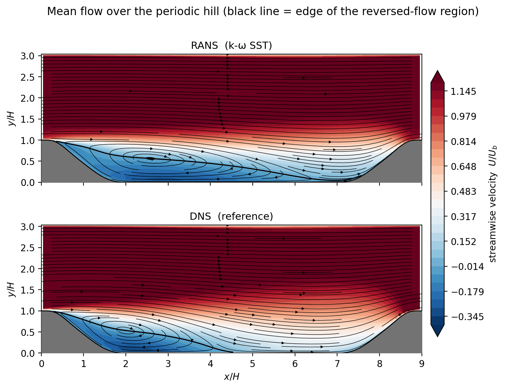
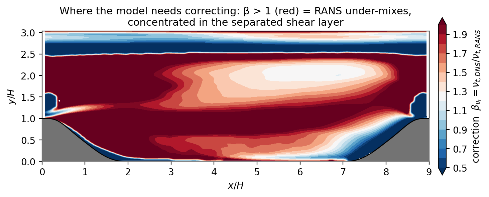
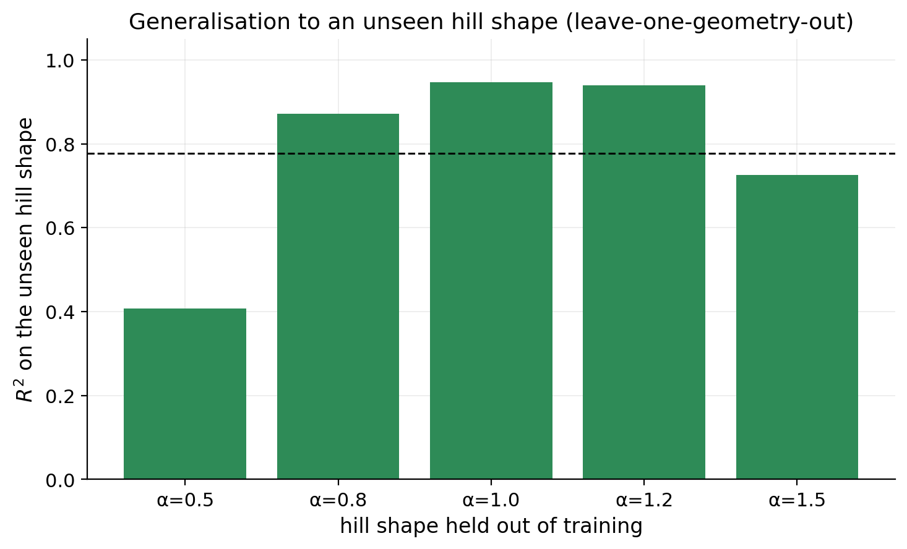
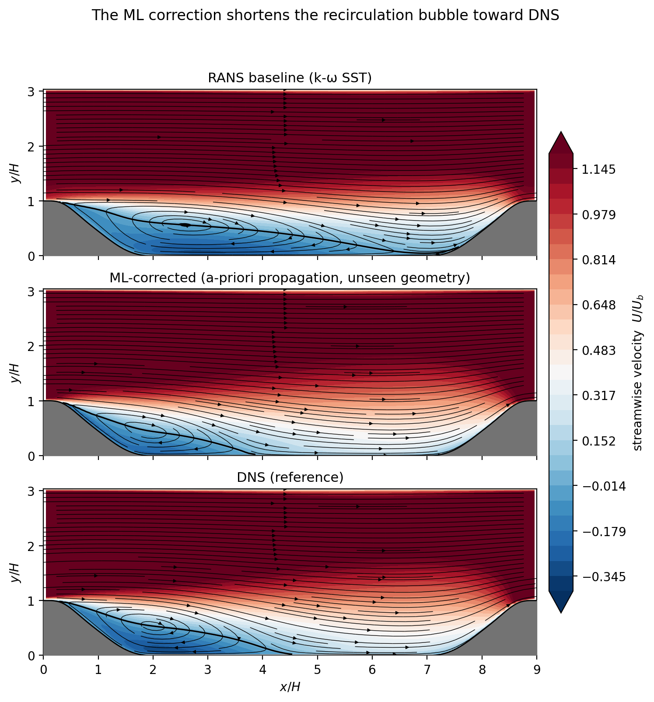
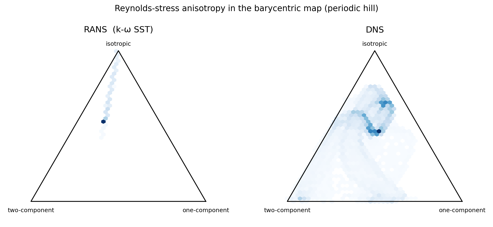
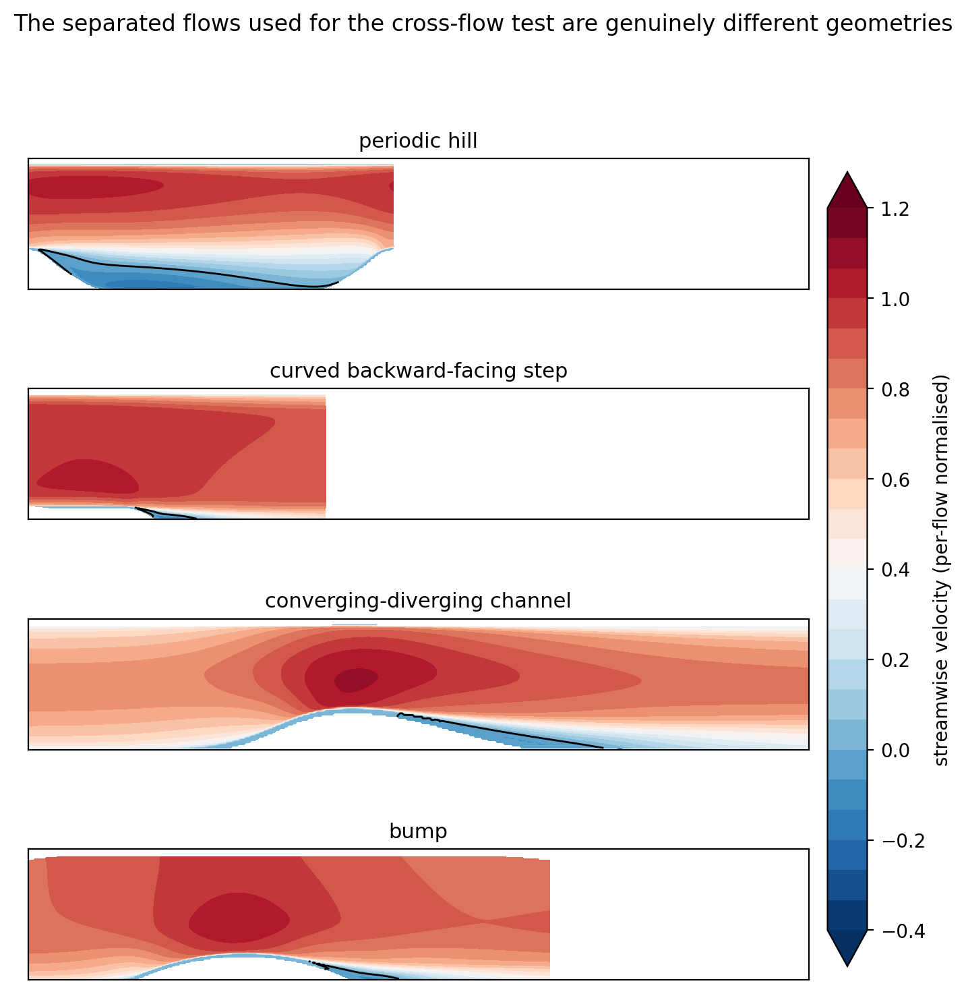
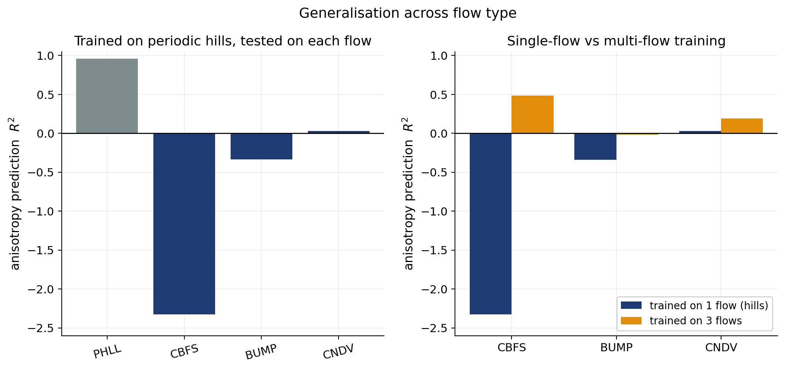

# Results

A walk-through of the study, with the headline numbers and the figures they come
from. Every number is from real converged CFD and the public DNS databases;
nothing is fabricated. Unless stated otherwise, models are validated
**leave-one-geometry-out** (train on four hill slopes, predict the unseen fifth)
and reattachment is measured from the sign of the near-bottom-wall velocity,
applied identically to RANS and DNS.

The benchmark is the periodic hill at `Re_H = U_b H / ν = 5600`; the reference is
the parameterised-geometry DNS of Xiao et al. (2020), five hill slopes
`α ∈ {0.5, 0.8, 1.0, 1.2, 1.5}`. The provided OpenFOAM cases supply, per
geometry, a RANS-comparable mesh **and** the DNS mean velocity and
Reynolds-stress tensor on that mesh, so RANS and DNS are co-located.

---

## 1. Baseline model-form error

Steady `simpleFoam` with **k-ω SST** predicts the separation point well
(x/H ≈ 0.41 = DNS) but **over-predicts reattachment badly** — the recirculation
bubble is ~65% too long:



| | reattachment x/H |
|---|---|
| DNS | 4.5 |
| **k-ω SST** | **7.5** |

The baseline reattachment is **mesh-independent** (7.48–7.50 over 8k→72k cells,
GCI ~0.1%), so this is genuine physics, not discretisation error, and the DNS
value (4.5) matches the published Re=5600 result — validating the metric. A
second closure brackets the truth from the other side (k-ε reattaches at 3.5),
confirming the error is closure-specific.

---

## 2. The correction target (β_nut)

The interpretable target is an eddy-viscosity multiplier
`β_nut = ν_t,DNS / ν_t,RANS`, with `ν_t,DNS` inferred from the DNS Reynolds shear
stress via Boussinesq. **Median β_nut ≈ 1.3–1.6, rising with hill steepness** —
k-ω SST systematically *under*-mixes, more so for stronger separation. About
**20% of cells are counter-gradient** (ν_t,DNS < 0), where the eddy-viscosity
ansatz breaks down; these are flagged and excluded from training, not fit.



---

## 3. A-priori generalisation to an unseen hill shape

Learning `log β_nut` from RANS-local features and validating leave-one-geometry-out:



| model | position features | invariant (geometry-agnostic) |
|---|---|---|
| ridge | 0.11 | 0.06 |
| **random forest** | **0.82** | **0.78** |
| gradient boosting | 0.68 | 0.69 |

The mapping is strongly nonlinear (ridge fails). Random forest reaches
**R² ≈ 0.82** out-of-geometry (0.89–0.96 interpolating to middle slopes, 0.63–0.66
extrapolating to the extremes). Geometry-agnostic **invariant features** are more
physically defensible and *improve* the steepest-hill extrapolation while doing
worse on the mildest — a mixed, honest result. The generalisation R² beats a
constant-median baseline decisively, but the 5-geometry CI is honestly wide
(90% CI ≈ [0.62, 0.92]).

---

## 4. A-posteriori: does it improve the CFD?

Propagating the ML correction through the flow, on a **held-out geometry**:



| field | reattachment x/H |
|---|---|
| DNS | 4.50 |
| k-ω SST baseline | 7.46 |
| **corrected — ML β (unseen)** | **3.85** |
| corrected — exact DNS β | 3.48 |

The ML correction **cuts the reattachment error by ~78%** on a geometry it never
saw. Two honest results emerge on how the correction is coupled:

- **Frozen vs coupled.** With a compiled custom solver (`simpleFoamBeta`) that
  lets the turbulence model co-adapt, the velocity-profile RMSE vs DNS falls
  **0.106 → 0.037 (−65%)**, but reattachment moves only 7.46 → 7.18: the SST
  model **self-regulates** (its ν_t drops to 0.76×), partly cancelling a fixed
  ν_t-multiplier. So frozen studies *overstate* the reattachment benefit.
- **Self-consistency.** Evaluating β on the *corrected* flow (not the baseline)
  and iterating settles reattachment at ~5.5 — the single-shot over-corrects.

---

## 5. Why linear RANS fails: the anisotropy

β_nut corrects only the *magnitude* of the turbulent stress. The Reynolds-stress
**anisotropy** (its shape) is where a linear model is structurally wrong — its
states collapse onto a single line of the barycentric map, while DNS fills it:



Learning the anisotropy discrepancy is **defined in 100% of cells** (vs 80% for
β_nut) and generalises *better* across geometry (R² ≈ 0.93 / 0.99). But it exposes
two deep limitations:

- **Prediction (TBNN).** A tensor-basis neural network (invariance embedded)
  generalises *worse* than an unconstrained regressor. The diagnostic shows why:
  the leading eddy-viscosity coefficient **g₁ is unpredictable from the local
  invariants (R² ≈ 0)**, while g₂–g₄ are — the local-closure assumption fails for
  separated flow. Nonlocal/transport features roughly halve the gap (−0.78 →
  −0.44) but are not sufficient.
- **Propagation.** A second custom solver (`simpleFoamAniso`) injects the exact
  DNS anisotropy discrepancy — yet it only nudges reattachment (7.46 → 6.62) and
  does **not** reduce the velocity-profile error, reproducing the known
  **ill-conditioning of RANS to Reynolds-stress corrections** (Wu, Xiao et al.
  2019).

---

## 6. Generalisation across flow type — and the lever that works

The strongest test: train on periodic hills only, predict the anisotropy on
*completely different* separated flows (McConkey et al. 2021 — a backward-facing
step, bumps, a converging-diverging channel):





Trained on hills alone, anisotropy R² falls from **0.96 in-distribution to ≤ 0**
on the other flows. But training on **three** flows and testing on the unseen
fourth **substantially rescues it** — the backward-facing step recovers from
R² −2.33 to **+0.48**, and every flow improves. The single-flow failure is a
**data-coverage** problem, not a fundamental one.

The full generalisation picture:

```
interpolate geometry within a flow    R² ~ 0.9–0.96   (works)
extrapolate to extreme geometry       R² ~ 0.6–0.7    (degrades)
single-flow -> different flow          R² <= 0         (fails)
multi-flow  -> unseen flow             R² ~ 0.2–0.5    (largely recovered)
```

---

## The through-line

Data-driven closure for separated flow is hard at *every* stage, and this study
demonstrates each with working code: **predicting** the correction (g₁ is not a
local function of the invariants), **coupling** it (the turbulence model
self-regulates), **propagating** it (RANS is ill-conditioned to stress
corrections), and **generalising** it (single-flow training fails across flow
type) — *and* it shows the constructive way forward: training diversity
substantially rescues generalisation.

## Limitations

- Single Reynolds number; generalisation is tested across **geometry / flow
  type**, not Reynolds number (the Xiao databases are all Re=5600 — see the
  roadmap for the external-data path).
- The eddy-viscosity ansatz fails in the ~20% counter-gradient cells.
- The a-posteriori tests are frozen or fixed-field-coupled propagations, not a
  fully re-trained closure.
- rms normal-stress columns of the raw DNS files are unverified; only the
  Reynolds shear stress (used for β_nut) is relied upon.
